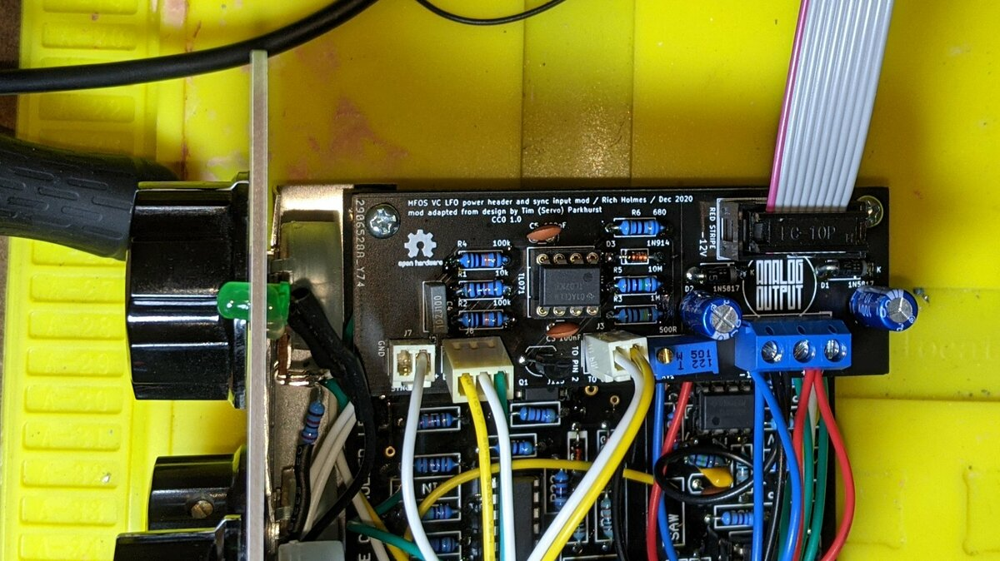
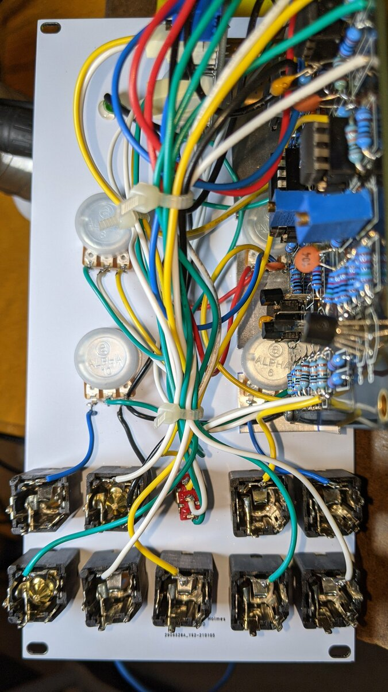
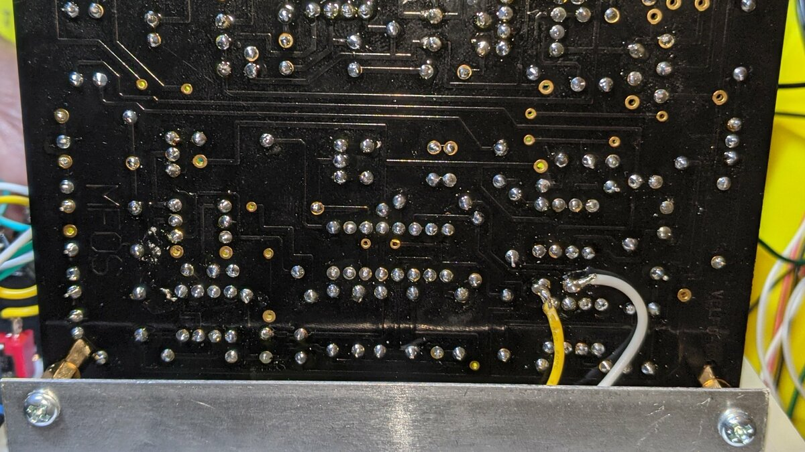

# MFOS VC LFO sync mod build notes

Reversal protection diodes and bypass capacitors should be mounted on the auxiliary board, the latter in place of the ones on the MFOS board, where they are C2 and C6. Wires from the terminal block connect to ±12 V and ground on the MFOS board. Wires from a 2-pin Molex connector connect to U2-A pins 1 and 2 on the MFOS board. Panel controls (SYNC IN jack and SYNC +/- switch) connect to the auxiliary board via Molex connectors.

The front panel includes space for the attenuator pots for the FM 1 and PWM control voltages. Use 100k for FM 1 CV and 25k for PWM CV. See [wiring diagram](../Images/panel_wiring.pdf) and images below for how to connect attenuators to CV inputs and PCB.

Look at the triangle wave output on a scope, plug a low frequency square wave into the Sync input and trigger your scope on the rising edge of that. You should see a discontinuity in the triangle wave at the moment of the sync. Adjust the trimmer to make the triangle wave start at its minimum (switch in - position) or maximum (+ position) amplitude. If you don't have a scope, use the triangle wave to modulate an oscillator frequency and you should be able to trim it reasonably well.

## Connection images

* [Wiring diagram](../Images/panel_wiring.pdf)
