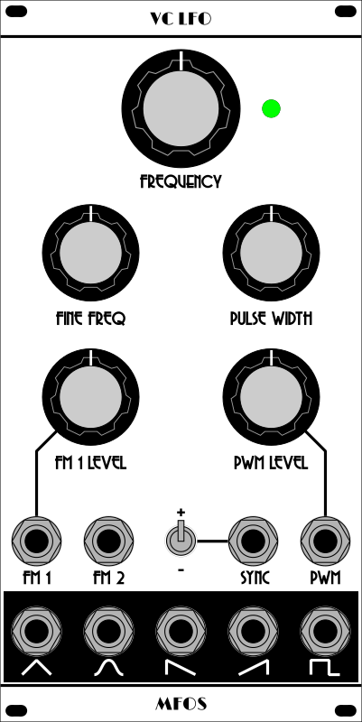

# MFOS VC LFO sync mod, pulse width fix, and Kosmo panel

This is a couple of modifications for the MFOS VC LFO and a Kosmo format front panel. One mod is component value changes, described below, that correct some undesired behavior having to do with the pulse width. The other is an auxiliary PCB that adds a sync input as well as a Euro/Kosmo style power header.

## Sync input

The auxiliary board adds a sync input. A rising edge on this input resets the LFO's triangle core to either the maximum or the minimum peak (switch selectable). This allows LFO modulation to begin in sync with e.g. the start of a note. Other outputs also are synced at either the "beginning" or the "midpoint" (in time) of the waveform.

This modification is based on Tim Parkhurst's [sync mod](https://electro-music.com/forum/post-387749.html#387749).  I added a switch to select whether to charge the triangle core to its maximum or minimum value, affecting where in each waveform sync occurs. Resistances were changed to accommodate the MFOS LFO's larger integrating capacitor, and I used J113 for the JFET instead of 2N3819. 2N5458 was also found to work, J112 did not. One resistor was made a trimmer to allow tuning the voltage to which the oscillator resets. It should be adjusted until the triangle wave is at its maximum or minimum immediately after syncing.

The auxiliary board also has footprints for a Eurorack style power header with reversal protection diodes and bypass capacitors (which should be mounted there instead on on the MFOS board, where they are C2 and C6) and a terminal block. Wires from the terminal block connect to ±12 V and ground on the MFOS board. Wires from a 2-pin Molex connector connect to U2-A pins 1 and 2 on the MFOS board. Panel controls (SYNC IN jack and SYNC +/- switch) connect to the auxiliary board via Molex connectors. See labels on the PCB to identify what connects where.

## Pulse width fixes

As designed, the MFOS LFO has some undesireable behavior with the pulse width. The PW CV input floats when nothing is plugged in, meaning that the pulse width and its range are different with no CV input versus with 0V CV input. Also, since the PW pot and its associated fixed resistors are large compared to the summing resistors, an attenuator on the PW CV (external or added to the front panel) will affect the behavior of the pulse width pot and vice versa.

I recommend the following changes:

* R37 (pulse width pot) from 100k to 25k
* R36 and R42 (fixed resistors at ends of R37) from 100k to 3.3k
* R58 and R59 (summing resistors) from 10k to 200k

With these changes I find the effects of the PW pot on the PW CV attenuator and vice versa are negligible, and I get a pulse width range from the knob (with no CV) of about 7% to 91%. 

## Front panel

A Kosmo format front panel is also provided. It includes space for the attenuator pots for the FM 1 and PWM control voltages. Use 100k for FM 1 CV and 25k for PWM CV. Width is 10 cm.

